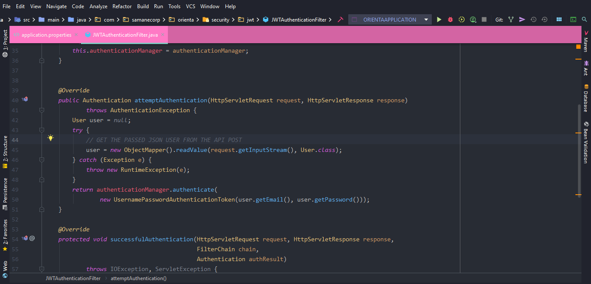

# Angular 11 JWT Authentication example

#IF YOU DOWNLOAD THE PROJECT IT CAN HAVING PROBLEM WORKING BECAUSE IT WAS MADE JUST TO DEMONSTRATE HOW TO SETUP THESE FOLLOWING :
-  AUTH.INTERCEPTOR.TS
-  AUTH.SERVICE.TS
-  LOGIN.COMPONENT.TS
-  API.CONFIG.TS
-  APP.MODULE.TS

> So you can use these files as they are in your project without any difficulty !

## PRE-REQUISITE
- ANGULAR-JWT2 ["angular2-jwt": "^0.2.3"]
- A BACKEND API APP ON SPRING BOOT WITH JWT CONFIGURED IN SPRING SECURITY

## Flow for User Registration and User Login
For JWT – Token based Authentication with Web API, we’re gonna call 2 endpoints:
- POST `api/auth/signup` for User Registration
- POST `api/auth/signin` for User Login

You can take a look at following flow to have an overview of Requests and Responses that Angular 11 Client will make or receive.


## Angular JWT App Diagram with Router and HttpInterceptor


## With Spring Boot back-end

> This project is the Front Client for a Spring Boot Backend. So it suppose you already have a fully finished Spring boot backend app with Rest Api and Spring Security Configured on JWT.

> The Backend Spring JWTAuthenticationFilter must be configured to receive JSON User to authenticate as the following:

--------------------------------------------------------------------------
Run `ng serve` for a dev server. Navigate to `http://localhost:4200/`.

## With Node.js Express back-end

> If You are on a Node.Js for your backend? You need some modification :

Open `app/_helpers/auth.interceptor.js`, modify the code to work with **x-access-token** like this:
```js
...

// const TOKEN_HEADER_KEY = 'Authorization'; // for Spring Boot back-end
const TOKEN_HEADER_KEY = 'x-access-token';   // for Node.js Express back-end

@Injectable()
export class AuthInterceptor implements HttpInterceptor {
  ...

  intercept(req: HttpRequest<any>, next: HttpHandler): Observable<HttpEvent<any>> {
    ...
    if (token != null) {
      // for Spring Boot back-end
      // authReq = req.clone({ headers: req.headers.set(TOKEN_HEADER_KEY, 'Bearer ' + token) });

      // for Node.js Express back-end
      authReq = req.clone({ headers: req.headers.set(TOKEN_HEADER_KEY, token) });
    }
    return next.handle(authReq);
  }
}

...
```

Run `ng serve --port 8081` for a dev server. Navigate to `http://localhost:8081/`.
